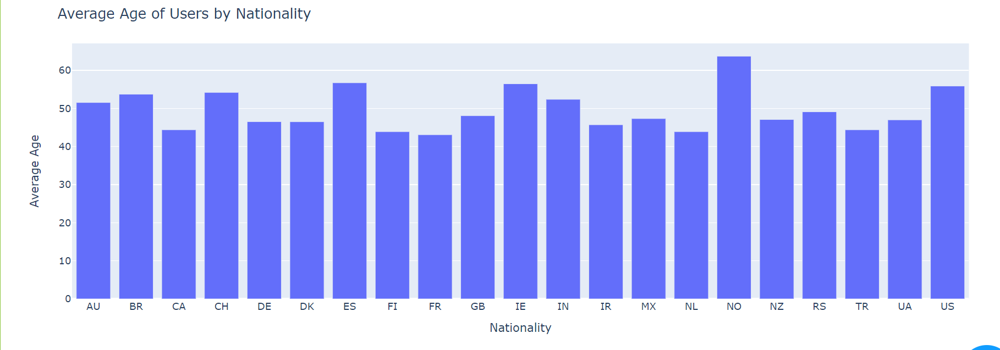

# Real-time-Data-Pipeline-Development-for-User-Profile-Analysis

### In today's data-driven world, organizations must be equipped to process and analyze data in real-time to make informed decisions. This project is designed for data professionals seeking practical skills in implementing real-time data pipelines.

📊 **Features:**

- Real-time data streaming with Kafka.
- Efficient data transformation and aggregation.
- Storage of user profiles in Cassandra and data insights in MongoDB.
- Data visualization using Python Dash.
- GDPR compliance and data privacy management.

🛠️ **Getting Started:**

To get started, make sure you have the necessary tools and dependencies in place:

- [x] Install and configure PySpark.
- [x] Set up Kafka, Cassandra, and MongoDB, optionally using Docker.
- [x] Download the required JAR files and place them in `D://spark_dependency_jars`.

⚙️ **Project Structure:**

- `src/`: Contains the source code for the data pipeline.
- `scripts/`: Helpful scripts for tasks like ACL management in Kafka.
- `documentation/`: Resources for GDPR documentation and data sorting procedures.

🚀 **Implementation Steps:**

1. **Configuration and Dependencies:** Ensure your environment is properly configured.

2. **Data Saving Functions:** Customize `save_to_cassandra_table` and `save_to_mongodb_collection` functions.

3. **Spark Session Initialization:** Create a Spark session with the necessary configurations.

4. **Reading from Kafka:** Set up Kafka to stream user profile data.

5. **Data Transformation:** Define data schema, parse Kafka messages, and perform transformations.

6. **Saving Transformed Data:** Save transformed data to Cassandra.

7. **Data Aggregation:** Aggregate data to gain insights and save results in MongoDB.

8. **Debugging and Monitoring:** Monitor output and validate data processing.

9. **Data Visualization:** Create data dashboards using Python Dash.

10. **GDPR Compliance:** Maintain records and procedures for GDPR compliance.

👨‍💻 **Contributing:**

Contributions are welcome! Feel free to open issues, submit pull requests, and enhance this real-time data pipeline project.

📜 **License:**

This project is licensed under the [MIT License](LICENSE.md).

📚 **Resources:**

- [PySpark Documentation](https://spark.apache.org/docs/latest/api/python/index.html)
- [Apache Kafka Documentation](https://kafka.apache.org/documentation)
- [Apache Cassandra Documentation](https://cassandra.apache.org/doc/latest/)
- [MongoDB Documentation](https://docs.mongodb.com/)
- [Python Dash Documentation](https://dash.plotly.com/)

🔍 **Issues:**

Open Issues: 
Closed Issues: 

  
Click to view the list of issues

### Open Issues:
  - [Issue Name 1](https://github.com/omardbaa/Real-time-Data-Pipeline-Development-for-User-Profile-Analysis/issues/1)
  - [Issue Name 2](https://github.com/omardbaa/Real-time-Data-Pipeline-Development-for-User-Profile-Analysis/issues/2)
  - [Issue Name 3](https://github.com/omardbaa/Real-time-Data-Pipeline-Development-for-User-Profile-Analysis/issues/3)

### Closed Issues:
  - [Issue Name 4](https://github.com/omardbaa/Real-time-Data-Pipeline-Development-for-User-Profile-Analysis/issues/4)
  - [Issue Name 5](https://github.com/omardbaa/Real-time-Data-Pipeline-Development-for-User-Profile-Analysis/issues/5)
  - [Issue Name 6](https://github.com/omardbaa/Real-time-Data-Pipeline-Development-for-User-Profile-Analysis/issues/6)

**Data Visualization:**

- Number of Users by Nationality

- Average Age of Users by Nationality
  

- Average Age of Users by Country
 

- Most Common Email Domains
 

 
Enjoy working with real-time data and happy coding! ✨
